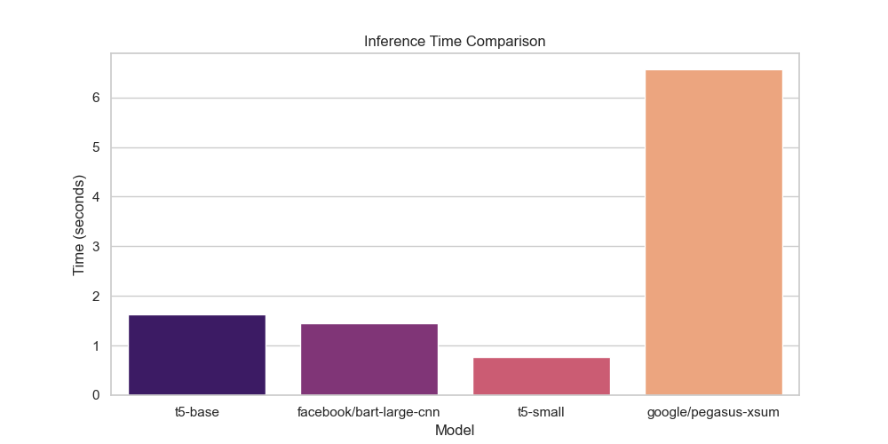
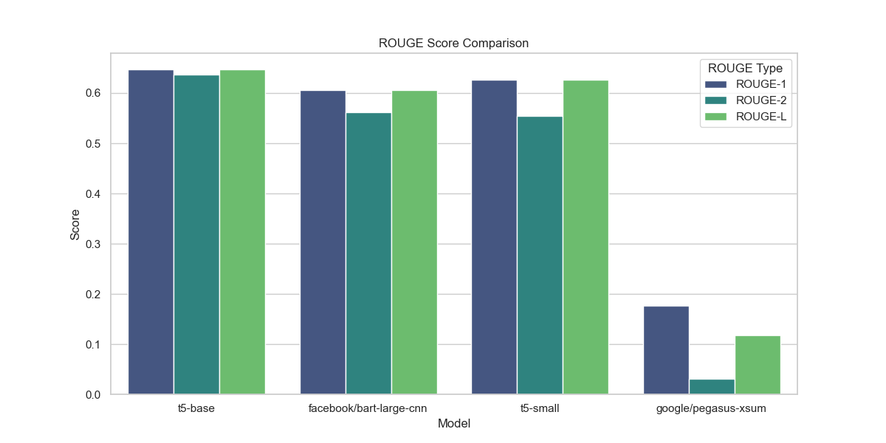
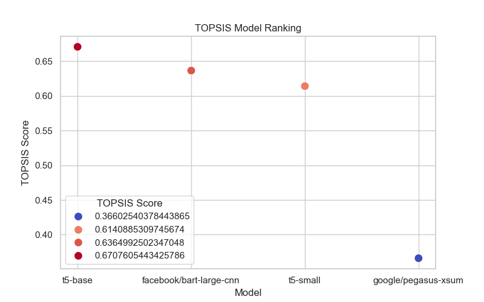

# Summarization Model Evaluation

## Overview
This project evaluates multiple text summarization models based on inference time, ROUGE scores, and TOPSIS ranking. The goal is to identify the most efficient and effective model for summarization tasks.

## Evaluation Criteria

### 1. Inference Time Comparison
Inference time is a crucial factor in selecting a summarization model, particularly for real-time applications. The following chart compares the inference times of different models:



### 2. ROUGE Score Comparison
ROUGE (Recall-Oriented Understudy for Gisting Evaluation) is used to measure the quality of generated summaries by comparing them with reference summaries. The comparison includes:
- **ROUGE-1** (unigram overlap)
- **ROUGE-2** (bigram overlap)
- **ROUGE-L** (longest common subsequence match)



### 3. TOPSIS Model Ranking
The **Technique for Order of Preference by Similarity to Ideal Solution (TOPSIS)** method ranks models by considering multiple evaluation metrics, ensuring a balanced assessment.



## Models Evaluated
- `t5-base`
- `facebook/bart-large-cnn`
- `t5-small`
- `google/pegasus-xsum`

## Datasets Used
Summarization models were tested on benchmark datasets to measure their effectiveness across different evaluation metrics.

## Files Included
- **summarization_model_evaluation.csv** - Contains the performance metrics of different models.
- **topsis_ranking.csv** - Includes TOPSIS ranking data for model selection.
- **topsis_evaluation.ipynb** - Jupyter Notebook for evaluating models using the TOPSIS method.

## How to Run
### Prerequisites
Ensure Python 3.7+ and necessary libraries are installed:
```bash
pip install transformers torch numpy pandas scikit-learn matplotlib
```

### Running the Evaluation
```bash
jupyter notebook topsis_evaluation.ipynb
```

## Conclusion
The evaluation provides insights into both the accuracy and efficiency of summarization models, helping users choose the best option based on their needs.

## Contributors
- Birendeep Singh
- 
## License
This project is open-source and available under the MIT License.
